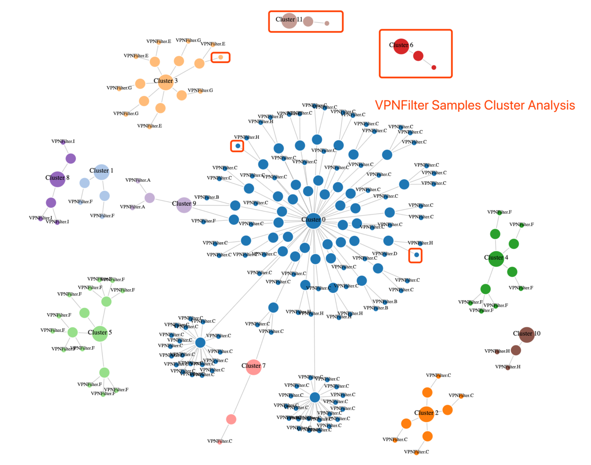

# ssdc
Ssdeep Cluster Analysis for Malware Files

Inspired by https://github.com/bwall/ssdc

# Usage
```
usage: ssdc.py [-h] [-c] [-d] [-g] [-e EXCLUDE] [-j JSONFILE] [-s SCORE]
                [-t TYPE]
                filepath

positional arguments:
  filepath              Specific the File Directory

optional arguments:
  -h, --help            show this help message and exit
  -c, --copy            Copy the similar files together to a new file
                        directory
  -d, --delete          Delete the similar files
  -g, --graph           Draw Cluster Graph
  -e EXCLUDE, --exclude EXCLUDE
                        Exclude similar files in this file Directory
  -j JSONFILE, --jsonfile JSONFILE
                        Save cluster json report to this file
  -s SCORE, --score SCORE
                        Specific the similarity score, list of choices: {0,
                        30, 60, 90}
  -t TYPE, --type TYPE  Specific the cluster type, list of choices:
                        {file_ssdeep, strings_ssdeep, imp_exp_ssdeep,
                        section_ssdeep, code_section_ssdeep,
                        rodata_section_ssdeep}

EXAMPLES:
	python ssdc.py /tmp/analysis_samples/ -d -s 0 -e /tmp/exclude_samples/
	python ssdc.py /tmp/analysis_samples/ -d -t imp_exp_ssdeep -s 30 -e /tmp/exclude_samples/
	python ssdc.py /tmp/analysis_samples/ -d -t strings_ssdeep -s 30 -e /tmp/exclude_samples/
	python ssdc.py /tmp/analysis_samples/ -g

Mail bug reports and suggestions to <zom3y3@gmail.com>
```

# Graph

